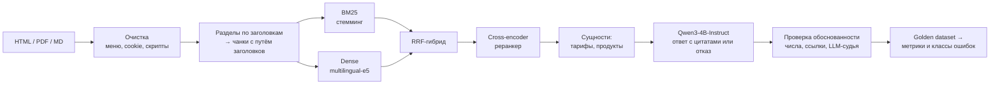

# RAG-ассистент по документации для малого бизнеса

Прототип корпоративного AI-ассистента, который отвечает на вопросы клиентов по банковской документации
(тарифы РКО, эквайринг, кредиты, зарплатный проект) и **измеряет собственное качество**. Проект охватывает
весь путь PoC: подготовку данных, поиск, сопоставление сущностей, генерацию на Qwen, golden dataset,
массовый прогон, метрики retrieval и галлюцинаций, а также локализацию причин ошибок.

[](https://colab.research.google.com/github/serge3emskov/rag-smb-assistant/blob/main/notebooks/rag_smb_assistant_colab.ipynb)



## Что внутри

| Задача | Реализация | Код |
|---|---|---|
| Подготовка данных из файлов | HTML (сохранённые страницы) и PDF → очистка от навигации и баннеров → секции по заголовкам | `loaders.py` |
| Контекст для RAG | чанки не пересекают границы разделов, к тексту добавлен путь заголовков, перекрытие по предложениям | `chunking.py` |
| Поиск | BM25 со стеммингом, dense (e5 / bge-m3), TF-IDF по n-граммам как офлайн-замена, RRF, реранкер bge-reranker-v2-m3 | `retrievers.py` |
| Сопоставление сущностей | каталог тарифов и продуктов с алиасами; падежи через стемминг, опечатки через fuzzy; буст «своих» разделов и штраф разделам о похожих продуктах | `entities.py` |
| Генерация | Qwen через transformers (Colab) или любой OpenAI-совместимый сервер (Ollama, vLLM); ответ только по контексту, ссылки `[n]`, фиксированная фраза отказа | `llm.py`, `prompts.py` |
| Детектор галлюцинаций | числа, которых нет в процитированном фрагменте; несуществующие ссылки; предложения без лексической опоры; LLM-судья по утверждениям | `grounding.py` |
| Golden dataset | JSONL: опорные подстроки (evidence), обязательные факты, ожидаемые сущности, типы вопросов, включая неотвечаемые; валидация разметки против корпуса | `golden.py` |
| Массовый прогон и метрики | Hit@k, MRR, Recall опорных фактов, точность сущностей, fact recall, hallucination rate, ложные и верные отказы; сравнение конфигураций | `evaluation.py` |
| Локализация ошибок | каждый провал относится к первому сломавшемуся этапу (сущность → поиск → отказ → галлюцинация → неполный ответ) с подсказкой, что чинить | `evaluation.py` |

## Быстрый старт

**Colab (Qwen + GPU):** откройте ноутбук по кнопке выше, выберите T4 GPU и запустите все ячейки. Полный прогон занимает около 10 минут.

**Локально, без GPU и интернета** (BM25 + TF-IDF + экстрактивный baseline):

```bash
pip install -e ".[dev]"
python -m pytest -q                                 # 18 тестов
python -m smbrag ask  -c configs/demo.yaml "Сколько стоит тариф Делавой ритм в месяц?"
python -m smbrag eval -c configs/demo.yaml --golden eval/golden_demo.jsonl --out reports/demo_offline
```

**Локально с Qwen через Ollama:** `ollama pull qwen3:4b`, затем в конфиге `generation.backend: openai`.

## Данные

* **`data/demo/`** — документация вымышленного «Банка Пример»: 7 документов и каталог из 11 сущностей. Тарифы
  («Первый шаг», «Деловой ритм», «Бизнес-Макс») намеренно похожи друг на друга, чтобы проверять путаницу
  сущностей. Все названия и цифры вымышлены.
* **`eval/golden_demo.jsonl`** — 42 вопроса: single, paraphrase, typo, entity_confusion, multi_hop и 6 вопросов
  без ответа в документах.
* **`data/sber/`** — инструкция по сбору корпуса из документации СберБизнеса. Сайт запрещает автоматический
  сбор, поэтому страницы сохраняются вручную и в репозиторий не попадают. Шаблон вопросов лежит
  в `eval/golden_sber.template.jsonl`.

## Результаты на демо-корпусе

Офлайн-прогон (BM25 + TF-IDF, без LLM), полный отчёт — [`reports/demo_offline/report.md`](reports/demo_offline/report.md).

| Конфигурация поиска | Hit@1 | Hit@3 | MRR | Точность сущностей |
|---|---|---|---|---|
| BM25 | 83.3% | 100% | 89.8% | — |
| TF-IDF (символьные n-граммы) | 86.1% | 100% | 92.6% | — |
| Гибрид (RRF) | 86.1% | 100% | 92.1% | — |
| Гибрид + сущности | **88.9%** | 100% | **94.4%** | 100% |

Экстрактивный baseline верно отвечает на 80.6% отвечаемых вопросов, но почти не умеет отказываться: верный
отказ получен только на 1 из 6 неотвечаемых вопросов. Qwen в Colab закрывает обе проблемы; ноутбук
выводит сравнение «baseline против Qwen» на тех же вопросах.

> Демо-корпус маленький: 7 документов, 32 чанка. Hit@3 = 100% здесь означает «поиск не узкое
> место на игрушечных данных», а не «поиск решён». На реальной документации метрики ниже, и именно там
> видна польза от реранкера и каталога сущностей.

## Что нашлось в процессе

* **Падежи ломают распознавание сущностей.** Вопрос «сколько платежей на Деловом ритме» не совпадал
  с алиасом «деловой ритм», и 4 из 36 вопросов попадали в `entity_miss`. После перевода сопоставления на основы
  слов точность распознавания выросла до 100%.
* **Буст по сущностям поднимал упоминания, а не разделы.** Вопрос о стоимости «Делового ритма» получал на
  первом месте раздел о бухгалтерии, где тариф упомянут в одной фразе. Разделение на `entities` (упомянуто в
  тексте) и `primary_entities` (стоит в заголовке раздела) с разным весом вместе с переходом на основы слов подняло MRR гибрида с сущностями с 92.6% до 94.4%.
* **Числа проверяются отдельно от текста.** В банковских ответах самая дорогая галлюцинация — неверная
  комиссия или лимит. Проверка «каждое число ответа есть в процитированном фрагменте» ловит её без LLM-судьи.

## Структура

```
src/smbrag/      loaders · chunking · retrievers · entities · llm · prompts · grounding · golden · evaluation · cli
configs/         demo.yaml (офлайн) · colab.yaml (dense + реранкер + Qwen) · sber.yaml
data/demo/       демо-корпус и каталог сущностей
data/sber/       инструкция по сбору корпуса СберБизнеса
eval/            golden dataset и шаблон для Сбера
notebooks/       ноутбук для Colab
reports/         отчёт офлайн-прогона
tests/           pytest, включая регрессионный порог качества
```

## Ограничения и следующие шаги

* LLM-судья в ноутбуке — та же модель, что и генератор; для итоговых цифр нужен независимый судья или ручная проверка выборки.
* Таблицы в PDF извлекаются как текст; для тарифных сеток стоит добавить парсинг таблиц (pdfplumber/camelot).
* Следующие шаги: декомпозиция multi-hop вопросов, порог отказа по score ретривера, структурированные запросы к
  тарифам (text-to-SQL поверх таблицы тарифов) вместо поиска по тексту.

Лицензия: MIT.

